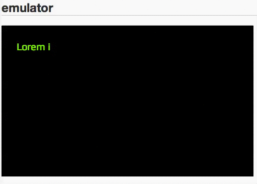

# GlobalJS-plugin-input-emulator

This is plguin for GlobalJS to emulate inserting.

## Screenshot



## Demo

[demo](http://kashiro.github.io/GlobalJS-plugin-input-emulator/)

## Depandency

* [GlobalJS](https://github.com/kashiro/GlobalJS)

## Usage

```javascript
var instance = Global.view.InputEmulator(param);
instance.start();
```

This class can set those param

* $elm: {Object} $elm jquery object to insert text
* data : {String[]|Object[]} data data of insert text
* bsKey: {String} bskey backspace keyword
* immediateBsKey: {String} immediatebskey backspace keyword to delete text immediately
* removeAllDelay: {Number} removeAllDelay interval msec to delete all text
* delay: {Number} delay interval msec to insert each text
